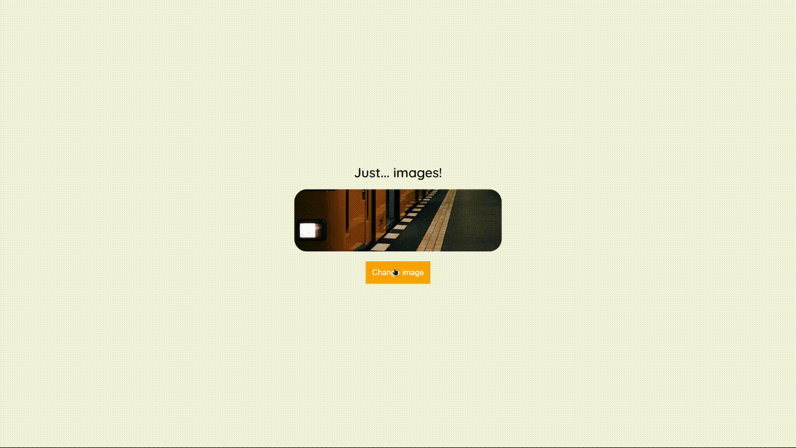

# Javascript Assíncrono

Este repositório contém a atividade prática do Curso "Javascript Assíncrono", que faz parte do Basecamp de Javascript ministrado pela [Digital Innovation One](https://digitalinnovation.one/).

## Atividade: API "imageAPI"

Nesta atividade, foi criado uma página que carrega fotos aleatórias sempre que clicamos em um botão.

- Foi utilizado a API `https://random.imagecdn.app` para fazer as chamadas com o método `fetch()`. Para carregar as imagens;

## Demo

